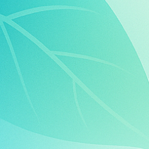
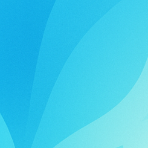
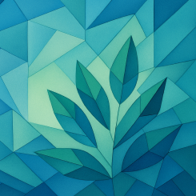
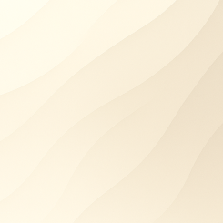

# Themes

A collection of [themes](https://xyd.dev/docs/guides/themes) for your projects.

## Theme Previews

  <table>
    <tr>
      <td align="center">
        <a href="https://cosmo.xyd.dev/">
           
          <b>Cosmo</b>
        </a>
      </td>
      <td align="center">
        <a href="https://gusto.xyd.dev/">
           
          <b>Gusto</b>
        </a>
      </td>
      <td align="center">
        <a href="https://opener.xyd.dev/">
           
          <b>Opener</b>
        </a>
      </td>
      <td align="center">
        <a href="https://picasso.xyd.dev/">
           
          <b>Picasso</b>
        </a>
      </td>
      <td align="center">
        <a href="https://poetry.xyd.dev/">
           
          <b>Poetry</b>
        </a>
      </td>
      <td align="center">
        <a href="https://solar.xyd.dev/">
           
          <b>Solar</b>
        </a>
      </td>
    </tr>
  </table>

